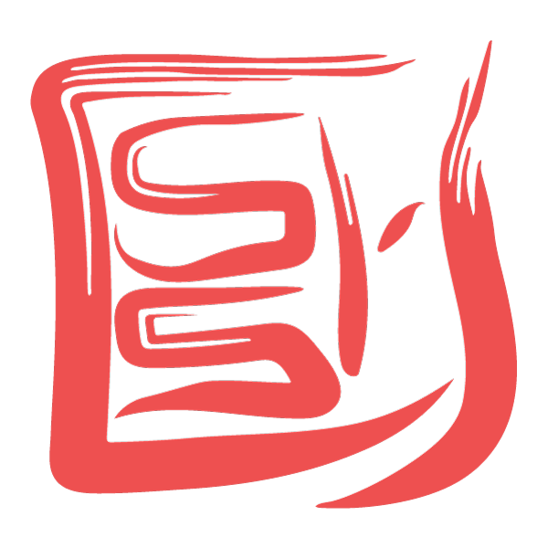

# CSSA简介

> 电脑可以访问 book.cssapsu.cn 阅读此新生手册

## I.概况

  
CSSA 全称为 **Chinese Students and Scholars Association，**是全美高校中最大最具影响力的中国学生组织。PSU CSSA 作为全美 CSSA 大家庭的有机组成部分,自 2001 年创建至今已有 19 年的历史。

Penn State CSSA 的宗旨是服务全体中国留学生和学者，增进团结和友谊，丰富业余生活，扩大中国文化在校园中的影响，最终达到增进中美两国、以及和其他国家青年人间 友谊的目的。在 CSSA 存在的这 19年里，我们可以自豪地说我们完美地完成了我们的任务，曾连续三年被学校评为 Penn State **最具影响力的学生组织（Outstanding Student Organization Award）**。2011 年中秋文化节更是获得 Outstanding Program of the Year，成为全校**唯一获得杰出奖项的国际学生组织，**更成为 PSU 全校唯一一个同时获得两项荣誉的学生组织。PSU CSSA 的成功是 PSU 华人活跃的体现，也是学校对中国学生学者整体素质的认可。欢迎大家加入我们 CSSA 的大家庭，共同谱写 CSSA 新的华美篇章！

## II.组成部分

### 主席团

主席团由主席，本科生副主席，研究生副主席，秘书长组成,负责带领组织长远健康发展。

### 10个部门

* 宣传部 \(Communication Department\)
* 财务部 \(Treasury Department\)
* 活动策划部 \(Culture Event Department\)
* 文体娱乐部 \(Recreation & Sport Department\)
* 学术发展部 \(Intellectual Development Department\)
* 公共关系部 \(Public Relation Department\)
* 人力资源部 \(Human Resource Department\)
* 网络部 \(Web Team Department\)
* THON 部 \(THON Department\)
* 研究生部 \(Graduate Student Department\)

每个部门由部长、副部长及 Officer 组成，分工协作完成各项活动。

### 3. 成员 Members

每一个华人，或对中国文化感兴趣的个体都是我们的一份子。CSSA不向任何成员以任何形式收取费用。 每个对中国社区发展和普及中华文化的朋友都可以以各种形式加入到CSSA的活动中去。我们需要更多有相同志趣的志愿者的付出和支持，来共同打造一个美好和谐的华人文化社区。

## 宾夕法尼亚州立大学中国学生学者联合会主席团及部长团成员

### 2020-2021

