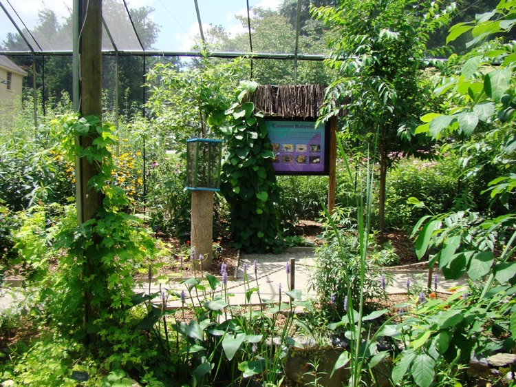

# 布兰德万河 Penn State Brandywine

Penn State 布兰德万河分校是一所坐落于Media，距离宾夕法尼亚州首府费城32公里的一个小校区。因此无论是从费城国际机场还是纽约国际机场到学校都十分方便，从纽约坐车到学校仅需2个小时左右。校园附近有很多商场，中餐厅，既可以满足日常生活所需，也可以在吃腻了食堂的时候有其他的选择。

布兰德万河分校的学生来自40多个国家，能够见识不同国家的文化和加深同学友谊。
校区的图书馆有免费的辅导，辅导的范围包含绝对多数的数学，英语，写作，物理方面等课程，甚至还有一些专业课的辅导如编程。辅导员大多是在该课拿到一定成绩的高年级学生或者有资历的老师，他们可以回答你不懂的问题，帮助你完成作业，查找资源等。一些辅导的课是可以修到1个学分的，只要按时出勤就可以很easy地拿到A，这样不仅可以对所修的课有所帮助，还可以提高自己的GPA。

## Honor Program

我校荣誉课程项目（honor program）分为cooper（gpa3.4-3.7）和schreyer（gpa3.7-4.0），设立了专属的荣誉课程及活动。如每学期末例行举办的socratic seminor（研讨会），荣誉课程的师生交流一学期课程的收获并告知下学期的计划安排。除此以外，荣誉课程的学生经常与校长和导师一起出席晚宴，丰盛的点心，与导师面对面的交流和结交朋友的机会，都成为荣誉课程的学生必去不可的理由。

## 校内宿舍

**Orchard Hall** 是去年才建好的新宿舍楼，比起住校外要便宜些，去上课从宿舍到上课的地方普遍走路10分钟以内。
宿舍楼一共四层楼，有通用的厨房，洗衣房，学习室。做饭的厨具要自己准备。洗衣房有洗衣机和烘干机，用lioncash里的钱就可以付款。
每个房间可以住两人，房间里每人都配有一套床，衣柜，写字桌，储物柜，微波炉和冰箱是一起用的。洗手间分布在楼层的各个位置，每个里面都有单独的房间洗澡。

## 校外住宿


 在校外住宿，需要自己在网上找房源，看房子。学校周围没有可以走路到的住宅区，所以要在校外租房的话要考虑每日上学的问题，下面也列举几个历往走读留学生住宿的选择


1）Glen Riddle Station

地址：275 Glen Riddle Road Media, PA 19063

电话：610-876-1288

[http://glenriddleapts.com/default.html](http://glenriddleapts.com/default.html)

2）Willowbrook Apartments

地址：3360 Chichester Ave.Boothwyn, PA 19061

电话：484-870-2942

[https://www.apartmentsatwillowbrook.com](https://www.apartmentsatwillowbrook.com)

3）West End Flats

地址：West Baltimore Avenue, Media, PA

电话：215-907-9420

[https://www.westendflatspa.com  
](https://www.westendflatspa.com
)

## 生活

### 1）校内餐厅

**Meal Plan** 住校的学生都会被要求签订House & Food Service Contract，里面不仅包括住房，还有校内就餐。住校的学生都被要求购买学校的Meal Plan，就是学期前先存一笔钱进校卡，之后在食堂买食物的时候可以直接刷校卡。Meal Plan共有三种档次，可以根据平时在校吃饭的次数选择，钱不够了可以再充，多了的学期结束不会退款。

### 2\)  校外餐厅

学校周围餐厅不少，选择很多，不过都需要坐车去，下面为大家推荐几所校外附近的亚洲餐馆。

**1.龍园\(Margaret Kuo’s\)**

地址：位于距离学校10分钟车程的Media小镇，4-6W State St, Media, PA

介绍：高端上海餐馆，口味正宗，主上海菜系，但还有别的菜系和日本刺身等，菜的分量较大，消费大约20多刀一位。

**2.上海园\(Toms Dim Sum\)**

地址：位于离学校10分钟车程的Media小镇，13E State St, Media, PA 19063

介绍：同上海餐馆，口味较正宗，价格对比龍园要亲民不少，主要以上海的汤包，面条，饺子，烧菜为主，有外卖服务。

**3.韩国城H-Mart**

地址：7050 Terminal Sq, Upper Darby, PA

介绍：位于韩国城，距离学校大约20多分钟车程，H-Mart一楼是亚洲超市，二楼有韩国和日本的料理店，价格都比较实惠。

### 3）购物

1.King of Prussia Mall

作为东部最大的商城，King of Prussia一定是留学生购物的首选地点。各大品牌，奢侈品店都有在那里入驻，商城里还有来自世界各地的美食，边吃边玩基本上逛一天都逛不完，绝对是节假日购物的最佳场所，而且幸运的是这座东部最大的商城距离学校仅达30多分钟的车程，地址：160N Gulph Rd, King of Prussia, PA

2.Springfield Mall

Springfield Mall是距离学校最近的商场，里面有Macy, Target等，还有各种餐厅以及电影院，地址：Baltimore Pike, Springfield, PA

3. Philadelphia Outlets

如同传统的奥特莱斯，里面有各大品牌的工厂店，费城奥莱的品牌并不算很多，但也是一个节假日打折时购物的好去处，地址：Lightcap Road, Pottstown, PA

### 4）超市

1.Acme

地址：West Baltimore Pike, Media, PA

2. Target

地址一：Hatton Drive, Glen Mills, PA （tip：这家离学校比较近）

地址二：Baltimore Pike, Springfield, PA

3.Wawa

地址：West Baltimore Pike, Wawa, PA

## 游玩

### 1）Tyler Arboretum:

地址： 515 Painter Road, Media, PA 19063 ； 以巨大的树屋和登山径闻名，学校有时会组织去，带学生id门票价$9

### 
2）Longwood Gardens:

地址：1001 Longwood Rd, Kennett Square, PA 19063；一个环境非常优美的园林，里面有许多喷泉，湖泊和一大片花丛地，到了晚上会有精彩的喷泉表演，尤其是到了接近圣诞的时候，树木会挂上各种装饰品十分漂亮，学校每年会组织国际生去这里游玩，很推荐的地方

### 3）Linvilla Orchards: 

地址：598 Linvilla Rd Media, PA 19063；Penn State Brandywine在每年秋天丰收的时候都会组织去Linvilla Orchards游玩，传统项目包括hayride, bonfire和apple picking等

