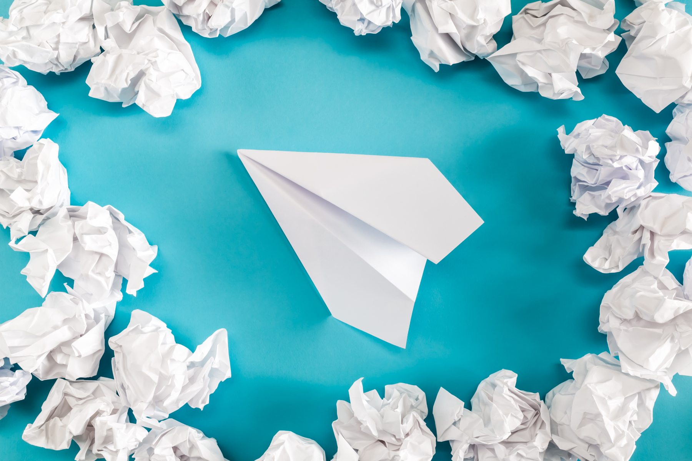

# 签证

必备材料（签证时先交予交材料窗口，后直接交予签证官的材料）：

     1. SEVIS I-901 交费收据（俗称美国国安费，可在线

提交，必须收到I-20才填写，金额200美元，可用信用卡交费）网址：https://www.fmjfee.com

     2. 签证申请费收据 （用预约确认信也可以，上面有申

请费收据号码）

     3. DS-160表格确认页 （必须收到I-20表格以后才填

写， 签证时带确认页）

     4. 51毫米x51毫米白色背景照片\(不得佩戴眼镜\)，保存

电子版，并且洗出2张纸质的照片。

     5. 有效护照\(Passport\) \(有效期最好在一年以上，护

照需要延期的请尽早办理\)

     6. I-20原件（I-20需要申请人签字）

     7. 录取/奖学金的信件原件

     8. 财产证明

     9. 高中成绩单、毕业证明，生需提供大学在读证明、

大学成绩单及课程描述

【温馨提示】以上材料建议放在文件夹内，必备材料放在第一栏，其他辅助材料分栏放，并贴上标签，签证官需要时迅速拿出来。

填写DS-160表格

拿到录取包裹后，填写DS-160表格。

网址：https://ceac.state.gov/genniv/

DS-160表格一旦提交不可修改。提交以后生成的DS-160确认页打印出来，记录上面的十位条形码编号。立即着手在线预约面谈时间。建议距开学时间提前几个月面签，以避免高峰期面签时间预约困难，或拒签再签的情况。自13年3月16日起，大陆申请人可在线预约面签。  

**【温馨提示】**

     美国转学I-20程序 （针对于美国大学转学、美国高中毕业生）

     1. 在收到宾州州立大学录取通知后，需要去iStart填写

相应的申请I-20表格。除正常材料以外，还需上传现有的护照、签证、I-20所有页、I-94以及其他必要信息，你还需要留下现在学校的International Office联系方式。当你材料齐全之后，Penn State会和你现在的学校取得联系。

     2. 在现在所在学校填写transfer out表格，交由所在学

校的顾问（advisor / counselor），一般会由他们传真或邮寄给Penn State。

     3. 你的SEVIS记录会在你现在所在学校的学期结束之

后放出，并且递交给Penn State，Penn State需要1-2周的时间印刷新的I20，在暑期高峰期、寄回国内可能需要更长时间。如果需要邮寄，Penn State都会提供一个追踪号码（tracking number）。

     4. 拿到I20之后，需要去填写DS160表格预约签证。

转学生都需要重新面签（如果中间不回国，就暂时不需要面签）面签时候除了必要的录取通知书、I20等重要材料，建议还带上原先学校的毕业证书、成绩单等，并且准备回答「为什么选择转学」、「为什么选择更换专业」等问题的回复。

     5. 此条适用于所有国际生，对于SEVIS完成注册状态

的唯一条件就是，参加international student orientation。和完成DISSA online document check-in（会在

orientation期间完成 ）。如果没有办法做到，你的状态会出现问题，严重影响到以后的学习生活，很有可能会
被要求离境再入境。

