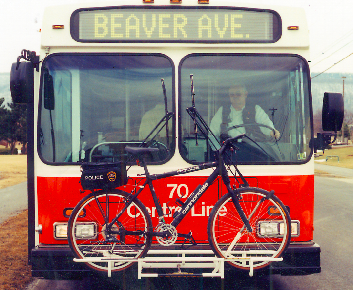

# 交通

## 公交（CATABUS）

State College的公交系统是由CATA公司运营的，线路由字母命名，票价$2。

### 线路类型

#### 1. Centre Line

基本覆盖了各主要居住区，商场及其他必要的场所。由于 State College是围绕 Penn State建设的，所以绝大多数的线路都会经过学校。

#### 2. LOOP/LINK

LOOP包括方向相反的两条环线BLUE LOOP和WHITE LOOP。LINK包括 以东西方向贯穿校园的GREEN LINK和RED LINK。途径campus和downtown大部分地区。这些线路都可以免费搭乘。

**【温馨提示】**

CATA BUS会在学校Pattee Library站点转换线路，即在 N（E），V（E），R（E）三条线路之间相互转换，次序为 R-N-V。转换线路时，巴士会提示大家，乘车的同学要注意千万不要坐错车。公车的前面都有自行车架,可以方便大家把自行车放在上面。

详情咨询：[http://www.catabus.com](http://www.catabus.com)

### 收费形式

**零钱**

票价为$2.00。付钱时纸币放入左边的纸币接收器，硬币投入右边的投币机，机器会自动计算，够了会亮灯并beep一声。

**Token**

类似于游戏币，用一次投一个。在HUB的Information Center或是downtown的CATA营业厅购买。20个$39。

**Buspass**

相当于月票或年票卡一样的卡，不限乘坐次数。一个月$79，四个月$309。在营业厅买的pass是所有线都可以坐的。还有一种公寓赠的pass则只能乘坐指定线路。

### 办公地点（Office）

Main Administrative Office

2081 Whitehall Road

Mon.- Fri. 8:00 a.m.–5:00 p.m., Sat & Sun Closed.

Downtown Pass Sales Office

108 E. Beaver Ave.

Mon.- Fri. 7:30 a.m.–5:30 p.m.

Sat.9:00 a.m.–1:00 p.m. & Sun Closed.

M

终点站是Nittany Mall。Mall的旁边还有一家Walmart和一家电影院Premiere Theater。

N

连接着学校校区和Target。 在 Target的不远处，有一家体育用品店Dick’s，可以买到各式各样的运动类产品，如球鞋，球拍，自行车等等等。还会经过Park Forest Apartment,State College Court,Copper Beech West Arron,Park Crest Terrace等多个住宅区。

V

V线是去Wal-Mart, BestBuy, Staples和Trader Joe’s购物的不二之选。另外会经过State College Court, Nittany Crossing, the Pointe,Lions Crossing, Vairo Village,Copper Beach Oakwood等多个住宅区。

R

贯穿小镇南面区域的公交线路，连接了很多住宅区域，像Parkway Plaza, Nittany Garden等，还有很多吃的地方，如 Fuji & Jade Garden, Pizza Hut等等。

UT

这条线能够到达SSN办公室和University Terrace。

W

连接着住宅区Heights，超市Giant，东方超市East Asian Market和学校downtown。

**White Loop：**

逆时针绕着校园转，经过Curtin road和Beaver Avenue。

在上课期间，这几条线路都是几分钟一辆车，非常方便。

建议同学们下载CATA App，要乘公交车时随时查看实时动态。

**Blue Loop：**

顺时针绕着校园转，经过Curtin road和College Avenue。

**Red Link：**

沿着Curtin Rd.由西向东，连接White Course Apartments和Penn Stater Hotel，经过BJC, Mount Nittany Medical Centre和Pattee Library。

**Green Link：**

与Red Link方向相反，沿着Curtin Rd. 由东向西，连接BJC和west area。

## Taxi

### 普通出租车

电话：814-231-8294，814-867-4646，814-355-5555

要提前打电话叫出租，一般10－30分钟左右。付钱可以用现金或刷卡，需要给小费。

### Uber

打车应用，一般5分钟之内附近的司机会到。App绑定你的信用卡，到达目的地后直接扣款。

### Lyft

打车应用，和Uber差不多。

### 自行车

需要先去注册自行车，注册完后才被允许在指定地方停放，注册是完全免费的。大家可以根据以下网站查询注册流程： [http://transportation.psu.edu/bicycle-registration](http://transportation.psu.edu/bicycle-registration)

### 长途大巴

与国内不同，美国城市之间的交通一般依赖大巴。从State College通向附近城市的大巴主要有Megabus， Greyhound，GotoBus（有时有直接到达JFK机场的专线），提前订票的话能得到大幅优惠。

[https://us.megabus.com/](https://us.megabus.com/)

[https://www.greyhound.com/](https://www.greyhound.com/)

[http://www.gotobus.com/](http://www.gotobus.com/)

## 共享单车 **Zagster**

[http://bike.zagster.com/psu/](http://bike.zagster.com/psu/)

### **PSU**联合**Zagster**共享单车服务

PSU在校生可选择加入共享单车**包年计划**（**20$/年**），便可以在校园内20余个单车站之间使用共享单车。加入包年计划后，工作日租车**一小时内**免费，超过一小时的部分按 **3$/小时** 结算。周末租车**三小时内**免费。

### **租车流程：**

**输入车的编码-&gt;输入动态密码-&gt;提车**

### **还车流程：**

**锁车-&gt;挂上安全锁-&gt;在app上结束租车**

如中途需要在租车站之外停车，请将单车按要求锁好。

### **校内单车站点**

