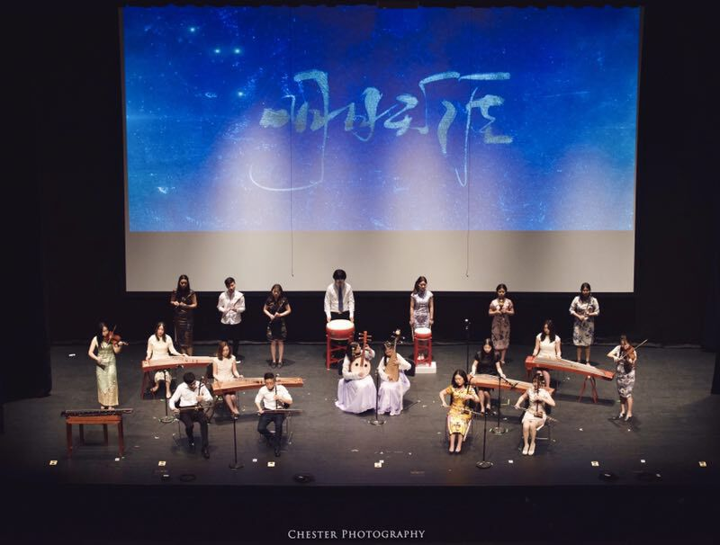
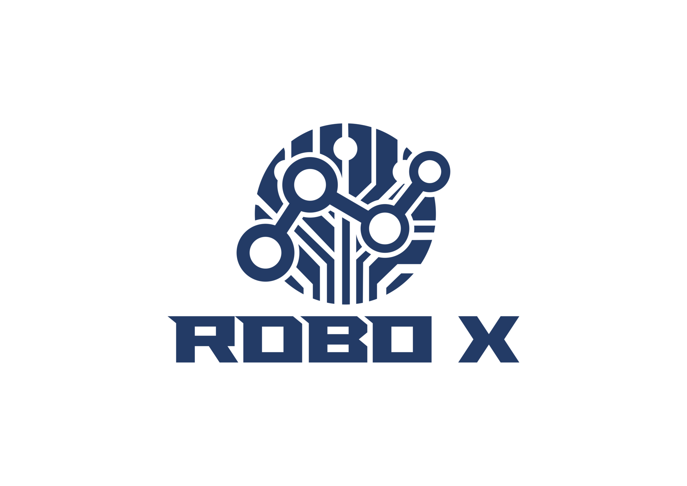

# 学生组织

**繁忙的学习生活之外，在PSU生活很重要的一部分便是加入一个适合自己的学生组织。相信你肯定可以在PSU超过800个学生组织中找到适合自己的一个。**

## Involvement Fair

每个学期两次的Involvement fair是一个了解各个学生组织非常好的方式，每年学期初的一天，大多数社团会在HUB聚集并支起展台，向新生详细地介绍自己的社团。同学们可以去转一转，找一找自己感兴趣的社团。如果你有极好的想法希望创建一个学生组织，也可以点击[https://studentaffairs.psu.edu/involvement-student-life/student-organizations/starting-organization](https://studentaffairs.psu.edu/involvement-student-life/student-organizations/starting-organization)，寻找相信信息。

**以下介绍一些同学们可能感兴趣的，比较大的社团和组织，以及一些专业相关的社团。**

## THON

网站：[https://THON.org/](https://THON.org/)

THON是一个学生运营的慈善组织，为了改善有患有癌症儿童的家庭的生活。Dance Marathon这个活动是通过一些舞者46小时不停歇地跳舞来呼吁更多人关注到儿童癌症患者并为他们筹集善款，每年二月底在BJC举办。这是世界上最大的学生运营非盈利性活动，也是PSU每年最火爆的活动之一。除了这个活动，Penn State的大部分学生组织会在全年以THON的名义展开各种Alternative Fundraising 活动去筹集善款，善款将直接纳入FOUR DIAMONDS FUND基金会，并直接帮助到Pennsylvania Hershey Hospital的癌症患儿们。迄今位置，Penn State THON迄今为止已经有40多年的历史了，帮助了至少4000多个癌症患儿家庭。在2018年，THON一共为癌症患儿们筹到了$10,151,663.93，Penn Staters给更多的癌症患儿家庭带去了温暖与希望。

### CSSA与THON

CSSA每一年都会积极参与到THON的活动中，CSSA内部也有专门的THON Department，为中国学者提供平台直接参与到THON当中，且荣幸的成为唯一一个有资格派出THON CHAIR以及参加THON WEEKEND的中国学生会组织。每年CSSA会组织义卖，洗车，情人节礼包，以及与节日相对应的活动等来筹集善款！除此之外，也有的筹款活动，比如Hershey Park Tour等等。到时候微信平台会有相关推送，大家可以关注一下，感兴趣的话可以报名，积极参与到THON中来，感受PSU的文化！

## Bounce 舞团

Bounce街舞社，全名Bounce Dance Organization，成立于2015年，是PSU Park校区成立最久的华人街舞社。社团涵盖Hip-hop, Jazz, Urban, Power Jazz, Wacking, Locking, Modern, K-POP，宅舞等舞种。社团会参与学校各种活动的表演，并每年举办专场演出。有基础或零基础的爱好者都可以加入，心动就请不要犹豫，Bounce街舞社等你。关注微信公众号Bounce街舞社，了解最新信息。

**微信公众号：bounce\_psu**

## 茶Institute

邮件：tea.psu@gmail.com

Facebook: [https://www.facebook.com/PSUTea/](https://www.facebook.com/PSUTea/)

Tea Institute at Penn State，注册于PSU Office of Physical Plant下的正式研究机构，是全世界唯一拥有中日韩三国茶道完整入门＋高阶课程的非营利性组织。茶社的Study Abroad Program包含参观最神秘的日本京都表千家总部、河东郡与韩国非物质文化遗产大师制作新茶和陶艺、去西双版纳的深处体验生普洱，亲口品尝全世界仅剩两块半的厂号7638普洱和1950年的正山大红袍。每学期亦可轻松拿到Liberal Arts Department签发的实习学分。搜索Tea Institute at Penn State了解消息信息。  

## PSU中文话剧社

PSU 中文话剧社，是PSU最大的华人戏剧社团，成立于2013年，旨在发掘戏剧表演的多元化、促进国际文化交流。在过去的三年中，话剧社先后编排并演出了12部话剧，如开心麻花的《乌龙山伯爵》、《夏洛特烦恼》，阿加莎克里斯汀的《无人生还》，赖声川导演作品《暗恋桃花源》以及桥田寿贺子的《结婚》。现如今PSU中文话剧社有稳定的幕后，宣传部门，整个社团稳定在70人左右，每个学期都会推出两部新剧与大家见面。

微信公众号：**drama\_is\_life**

## 龙之梦舞团

龙之梦舞团成立于2014年春季，是宾州州立大学首支中国古典舞舞团。舞团旨在宣传中国传统舞蹈，同时为本校中国舞爱好者提供了训练和表演的机会。舞团每周有一到两次常规训练，内容包括基本功训练、身韵训练和成品舞的编排。舞团成立至今已成功举办过四场showcase，同时该舞团每年都在中秋晚会和春节晚会等校文艺汇演中献上精彩的表演。大大小小舞蹈作品有十余多个，包括经典舞蹈如『桃夭』、『缱绻敦煌』、『采薇』等。

微信公众号：**classicaldance\_psu**

## **ACEs舞团**

ACEs舞团自2016年成立至今，通过9名初代成员的辛勤努力发展壮大，成为PSU拥有上百名成员的大型华人舞蹈社团，每年自主举办两次大型showcase，并与CSSA、CUSA、ISC等学生组织合作，也曾在THON的舞台上展示我们的热情！

ACEs舞团目前包含的舞蹈部门有Urban Family，Girls' K-pop，Boys' K-pop，Popping，Breaking，宅舞，以及幕后部门的Secretary，Event Planning，Media，Fund Raising，Styling。正是因为有各个部门的相互支持，才能够打造出现在的ACEs！

**ACEs大家庭，欢迎你的到来！**  

## **SRN中文电台**

SRN成立于2018年3月，全称为Pennsylvania State University SINO Radio & Newsletter \(PSU-SRN\)，非营利性，非宗教性，非政府性的媒体/自媒体组织。社团致力于帮助提高社员播音能力，纠正社员的各种口语问题，锻炼社员发声技巧，鼓励社员参与采访/主持/拍摄等活动。同时，将为听众/观众提供自媒体类节目。SRN为拥有成为一名媒体人梦想的同学提供广阔的平台。

**感兴趣的同学们可以关注：**

**WeChat: SINO-PENNSTATE** 

**Instagram: sinopennstate** 

**Email:**[**sinopennstate@gmail.com**](mailto:sinopennstate@gmail.com)  

## NP 摄影社

NP摄影社 – Non Profit Photo Studio（非盈利摄影工作室\), NP致力于为志同道合的摄影爱好者创建一个平台来追求和完成自己的梦想。该社团会定期举行一系列摄影相关的活动，比如由专业的摄影大神来演讲的摄影讲堂，各式外拍活动和春游带你领略各地风情特色，还有一年一度的影展也不容错过。总而言之，NP摄影社是就是一个摄影天堂。

**详情请关注微信号：npphotostudio**

## **Sirius 社团**

还记得曾经那个不知“天高地厚”的音乐社团Sirius吗？  
这个曾经年轻的只有几十人的小社团却在短短一年内发展至百人社团  
我们用心准备每一场演出，为的是满足你不愿将就的耳朵  
**我们是只为音乐不忘初心的Sirius**

## ISIA

**ISIA \(International Student Investment Association or 留学生俱乐部\)** 成立于2016年，是唯一一个属于中国留学生的金融社团，致力于Bring Financial Awareness。 该社团不仅向金融或商科专业的同学开放，还欢迎每个对金融市场，股票投资感兴趣的同学一起交流学习。除了每周四晚上由社团内部人员带来的金融方面讲座，ISIA每年都会举办career path，炒股大赛，以及邀请金融行业大佬的年终大会。 除了有为大家带来金融知识的社团核心研报部，还有与各大商家谈判并为社团带来经济来源的公关部，组织举办各种活动的活动部，编辑推文的线上部，和记录账本处理大大小小杂事的综合部。 无论你是什么专业，有没有金融基础，都欢迎大家加入我们，还可以解锁专属于部内的活动。

微信号公众号：**ISIGPSU**

## 恣肆梦剧场

恣肆梦剧场是PSU唯一的中文喜剧社团，创立于2015，梦剧场已成功推出5场爆笑舞台短剧专场和数场受邀演出。梦剧场是一个欢乐又有意思的社团，在每学期举办Show Case之外更有许多线下团建活动。在这里你不仅可以感受如何策划举办一场喜剧大戏，更有机会认识志同道合的伙伴。在这里你会明白，青春是奋斗，是伙伴，是尽全力不留遗憾。  
****

**欢迎关注公众微信号【zisimengjuchang】Instagram【thedreamcrew666】。**

## **United Product Vision Club（UPVC社团）**

UPVC是创业者的摇篮，在这里来自不同专业的学生会在一起学习，讨论与实践产品思维。学生们将有机会学习到课程上没有但又极其重要的创业知识，并可以学以致用，把理论放在实践中，组队一起做project。最后，社员还可以与互联网专家们network。 优秀的社员也有机会获得国内外500强的实习与工作机会。

## **NAAAP**

NAAAP — National Association of Asian American Professionals是一个主要由北美亚裔组成的全国性的职业组织，现已在美国二十多个城市建立分部。2017年夏天，Penn State NAAAP 正式成立，致力于为国际学生提供求职和学业上的咨询与帮助。在过去的两年里，Penn State NAAAP 成功地邀请到了包括IBM、Aldi、Target、Amazon等名企来为我们的成员进行演讲，并且和多家local business合作来为我们的成员提供优惠。成员们可以向前辈们预约线上模拟面试，并且在职业规划和专业选择方面向前辈们取经。

## ACMC民乐社

ACMC民乐团是PSU最活跃的华人社团之一，也是校内唯一的民乐社团。演奏乐器包括二胡、古筝、琵琶、中阮、笛子、古琴、小提琴、吉他等各类中西乐器，目前台前幕后成员共计近四十名。我社曾举办“初·韵”、“乐逍遥”及“韶光乐音”演奏会，也在校内外各国文化庆典上参与演出。不论你是活动策划、幕后宣传、摄影美编的能手，还是演奏中西乐器的大神，ACMC的大门都为你敞开。

微信公众号：**PSUACMC**

## 中国象棋社

**简介：https://www.chinesechessatpsu.com**

中国象棋社成立于2018年，是PSU第一个中国象棋社团。社团旨在提供一个交流象棋的平台、举办年度象棋比赛、以及传播象棋的知识与热爱。无论你是中国象棋的高手，或者是零经验的新手，我们都欢迎你的加入！一起来感受棋盘的魅力与风采吧！  

## 华人网球社

不管你是刚接触网球的萌新，打球多年的老手，还是驰骋球场的大神，PSU华人网球社都欢迎你的到来。我们不仅每周都有社团内的训练，学期中也有校内外的友谊赛，每年九月份还会组织大家一起去NYC看US OPEN！在这里你可以打球交友，提升球技，畅聊比赛，丰富自己的课余生活。快来加入吧～

**了解详情或加入社团请加社长微信: wujingping9527**

## PSU中国足球队

PSU中国足球队是State College地区华人足球唯一官方组织。球队成立七年，周周有球局，年年有比赛。现在，球队每周都会组织周中的训练和周末的欢乐野球局，寒暑不断，风雨无阻。球队每年都会参加各种比赛，State College超级联赛、北美华人美东杯足球赛、PSU宾州杯、匹兹堡三角杯、中韩友谊赛等等。为热爱足球的每一位提供展示自己的平台与机会。感兴趣的同学可以加入，在学习之余将自己的生活经营得更加丰富多彩。

## ELHA

亚洲服务业精英联盟（ELHA）成⽴于美国宾夕法尼亚州州立大学，后拓展分部到波士顿大学和密歇根州立大学，以酒店管理专业为中心发展在美留学生有关服务业的交流平台。ELHA不仅提供专业的Career tips以及招聘机会，更有各行各业优秀的大咖专访，有关吃喝玩乐的讯息自然也少不了。我们追求专业，创新，全球化，致力于亚洲服务行业。不仅很学术，还很嗨 **!**

微信公众号：**weareelha**

## ERO台球社

ERO台球社成立于2017年，是一个由华人组织的台球社团，我们主要活动的台球种类为美式八球、美式九球。在每个周中周末，台球社会组织丰富多彩的社团活动还有团建烧烤、春游。除此之外，我们每个学期还会为大家带来校际之间的友谊赛、正规比赛。我们欢迎每个对台球感兴趣的同学，无论你是一无所知的桌球小白，还是无师自通的桌球达人，更是经验老道的桌球大神，只要怀揣一颗桌球心，ERO台球社欢迎你们到来！

## 太极社

Penn State Taiji Club 成立于2007年 , 致力于在我校推广中国传统武术并且与现代训练体系相结合,促进中西方文化交流.包含杨氏太极拳,陈氏太极拳,太极推手实战,健身气功,擒拿,散打,防身术等多个武术流派,并且欢迎不同流派的同学互相交流学习. 社团每周两次固定集训,根据社团成团水平定期实战训练. 有无基础的同学都欢迎加入. 

想加入社团的同学可以搜索**Taiji Club PSU**了解。  

## **ACG同萌会**

PSU A.C.G Allies \(同萌会\) 致力于打造一个既宣扬二次元ACG文化，同时也兼顾吃喝玩乐的专业团队。只要你敢想，我们就帮你实现。

在这里，我们可以一起创作平面艺术、轻小说、同人本、月刊、原创游戏等属于自己的实体化作品；我们可以一起cosplay，体验Lolita文化，开办女仆咖啡和动漫展，打造最梦幻的2.5 次元世界；我们有深沉的技术宅团体，靠谱的半次元基地；只要你发自内心热爱着ACG, 我们期待着你的到来。  

## **心家团契**

心家团契\(Home of Hearts Fellowship\)是一个专属PSU本科生的基督教团体。我们是一群因着上帝的爱而相聚在一起的伙伴，每周五晚上6点我们在Osmond Laboratory聚会。我们一起分享美味的家乡美食、生活中的点点滴滴、以及讨论学习和信仰上所遇到的问题。每个月我们也都会推出好玩精彩的活动或专题，欢迎你们加入这个温暖的大家庭， 也希望心家能够成为你在Penn State心灵的家！

## Robo X 

ROBO X 是 Penn State 第一个华人机器人社团，也是一个让每一个工程圈小伙伴交流互助的社交圈。我们以“We Make Things” 为社团宗旨，专注于研究和学习个大机器人技能。社团活动有制造机器车,参加由大疆无人机公司举办的ROBOMASTER和ICRA 比赛等。对机器人和比赛感兴趣额朋友们都可以参加。欢迎有热情和想法的朋友们踊跃报名，相互交流～。

**ROBO X 社团微信公众号: PennStateRoboX**  

## **ECO Conservation Association**

ECO是Economy与Ecology的前缀。我们相信，通过拯救环境，我们可以在长期拯救我们的经济。反之亦然，通过伤害环境，我们会在长期伤害我们的经济。

我们推广绿色的生活方式，探讨环保话题，并为大家与商家推出省钱，省时间，省资源的解决方案。  

## **University Park Undergraduate Association \(UPUA\)**

UPUA是学校本科生的组织，UPUA的宗旨是为了改善每一个PSU本科生的生活。他们以联邦政府\(federal government\)的模式管理自己的组织，设有立法机构\(Legislative General Assembly\) ，行政部门\(Executive Branch\)及司法机构\(Judicial Board\)。这些学生每周腾出两个小时以上考虑学校与学生相关的各种事项，小到学生缴费改革，宿舍内饮酒alcohol policy，大到涉及学校管理层的相关新闻，UPUA都有责任代表全体学生作出自己的选择。有兴趣的同学可以发邮件或者加官方的Facebook和Twitter咨询。

[http://upua.org/](http://upua.org/)

## Alpha Kappa Psi

是一个金融方向的社团，为金融专业的学生提供非常多的信息。每个学期他们都会在Business Building Atrium举办活动，招募新的成员和对组织进行介绍。感兴趣的同学在Smeal商学院的官网上可以找到相关信息，也可以去Business Building拿他们的宣传单。

## Marketing Association

和ALPHA KAPPA PSI类似，只不过是面向学市场的同学的。也在学期初会在Business Building Atrium举办活动，感兴趣的同学可以去参加。

## Ascend

是一个非常大的Asian Pacific组织，为Asian Pacific学生提供非常多的帮助，活动是在Business Building举办，每个学期有$50的Due。为学生提供了一个展示自己的平台，同时可以认识非常多的同学，一起讨论感兴趣的项目。

## MACC Program Student Association

学校商学院提供MACC Program可以本硕连读拿到学位。Macc Program竞争非常激烈。在大二的时候会有面试，感兴趣的同学可以在官网上面找到非常多的信息。在PSU本科新生QQ群里面也可以问学长和学姐。

## Accounting Society

是一个会计方向的社团，是PSU自己的社团，会提供非常多会计相关的信息包括：公司信息，就业信息，如何写简历和介绍自己等等。每个学期初都会在Business Building Atrium举办活动，感兴趣的同学可以参加。

## Actuarial Science Club

是一个精算方向的社团。他们有非常专业和信息完备的官方网站。同学可以在上面找到他们所有的信息。也可以订阅他们的邮件，每隔一段时间都会发送相关信息包括：就业信息，精算专业考试信息等等。

## Math Club

为喜欢数学的同学提供一个地方和兴趣相投的同学一起讨论数学。

## Omega Phi Alpha

这是学校一个非常大的兄弟/姐妹会。给新生提供非常有利的帮助，帮助新生了解学校，提供一对一的帮助，带新生在校园里面走一走，认识一下学校不一样的地方。

## Advertising Club

是一个广告方向的社团，广告专业的学生可以再这里找到非常多有用的信息。

## Ambitions

这是学校非常大的一个舞蹈社团，提供非常专业的舞蹈指导，而且囊括几乎所有舞种，对舞蹈感兴趣的同学，可以去他们的官网看到相关信息。

## SPA

SPA的全称为\(Student Programming Association\)，旨在提高学生课外的生活质量。每个星期SPA都会在hub组织很多活动来丰富学生的课余生活，例如星期五晚上可以在hub免费做小手工，看免费电影等等。每个星期都会有些不同的活动。

[http://www.spa.psu.edu/](http://www.spa.psu.edu/)

## GCC

GCCPSU 全球中国连接（Global China Connection）是世界上最大的完全由学生组织与管理的非营利性组织。由哥伦比亚大学的华人学生发起，如今在全球顶尖高校已经拥有超过70个分部。与行业大牛零距离对话的同时，也通过这个平台与志趣相投的同辈们相互认识，建立起自己的社交网。  
GCC宾州州立大学分部成立于2016年，由一群充满激情的本科生带领；致力于创建中美交流互动平台。

**感兴趣的同学可关注GCCPSU官方微信：gccpsu。**  

## EPPIC

EPPIC的全称是English For Professional Purposes Intercultural Center，是一个为国际学生提供英语辅导的组织。EPPIC提供的帮助包括：撰写学术论文、编写学术邮件、修改Oral Presentation、写求职简历等。EPPIC联系邮箱：eppic@psu.edu，地点：201 Willard Building。

[https://eppic.la.psu.edu/](https://eppic.la.psu.edu/)

\*\*\*\*

